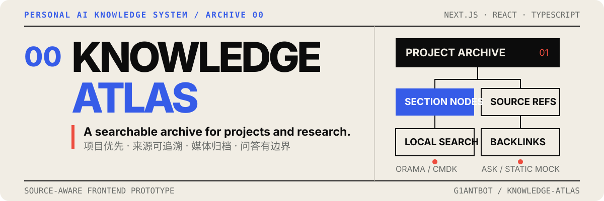
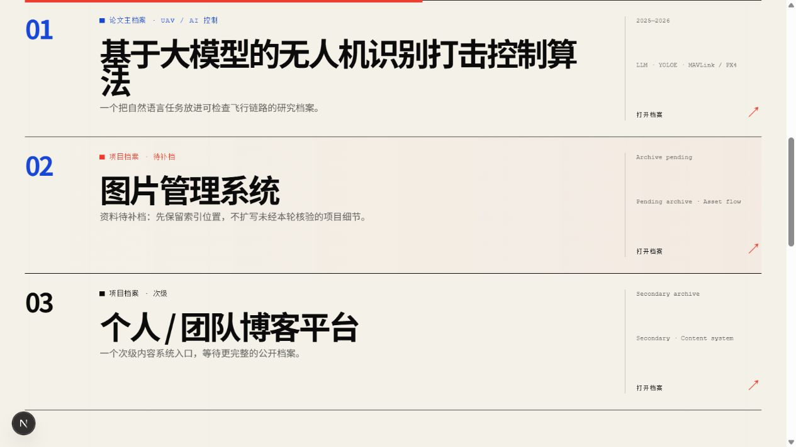
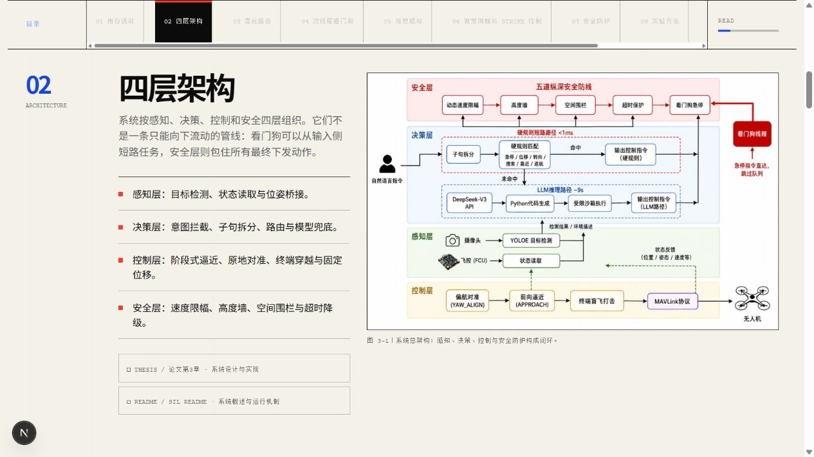
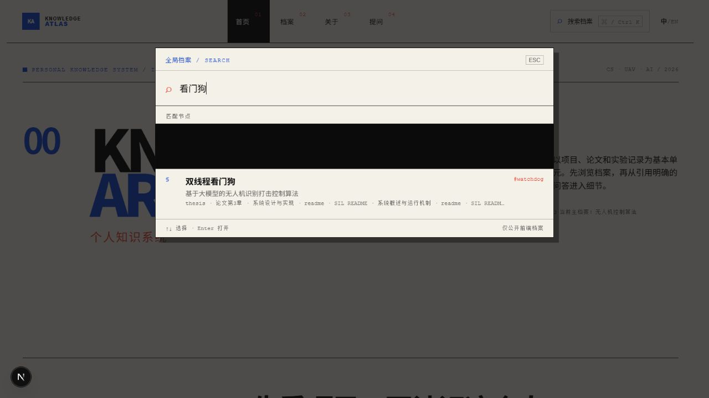
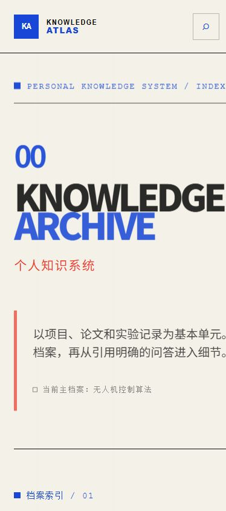
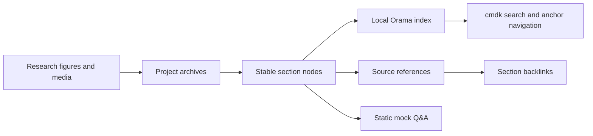

<p align="center">
  
</p>

<p align="center">
  <strong>一个以真实项目档案为核心的个人 AI 知识系统前端原型。</strong><br>
  <sub>A source-aware personal knowledge system built around projects, papers, experiments and evidence.</sub>
</p>

<p align="center">
  <a href="#功能证据">功能证据</a> ·
  <a href="#它是什么">项目说明</a> ·
  <a href="#快速开始">快速开始</a> ·
  <a href="#当前边界">当前边界</a>
</p>

---

## 功能证据

首页先展示档案，而不是人物照片、求职口号或能力评分。访客可以从项目进入章节，再沿来源、搜索与问答继续探索。

<p align="center">
  
</p>

<table>
  <tr>
    <td width="50%" valign="top">
      
      <br><strong>章节阅读</strong><br>
      瑞士国际主义编辑风目录、当前章节追踪、论文图例与来源标签。
    </td>
    <td width="50%" valign="top">
      
      <br><strong>档案检索</strong><br>
      使用 <code>Ctrl/Cmd + K</code> 搜索项目、章节、标签和来源，并跳转到具体锚点。
    </td>
  </tr>
</table>

<p align="center">
  
</p>

## 它是什么

Knowledge Atlas 把个人网站改造成一个可以持续整理和使用的知识入口：

- **档案优先**：项目是首页的第一层内容，个人背景退居系统说明之中。
- **章节化记录**：每个项目由摘要、方法、架构、证据、限制和媒体组成。
- **来源可追溯**：章节标明论文或实验说明来源，并生成来源到章节的回链。
- **本地全文检索**：Orama 在浏览器内索引公开档案，cmdk 提供键盘友好的搜索界面。
- **克制动效**：Motion 只用于档案入场和阅读进度，并尊重 `prefers-reduced-motion`。
- **双语界面**：核心导航与档案内容支持中文和英文切换。

## 内容如何流动



当前内容模型集中在 [`data/content.ts`](./data/content.ts)，页面不会从本机论文目录或实验目录直接读取文件。所有公开派生资源都位于 `public/`。

## 主档案：无人机识别与控制研究

目前最完整的档案是 **基于大模型的无人机识别打击控制算法**，内容来自论文相关章节、软件在环说明和经过筛选的演示素材。

档案包含：

1. 通俗摘要与四层系统架构；
2. 混合路由和双线程看门狗；
3. YOLOE 视觉感知；
4. 视觉伺服、目标逼近与终端穿越；
5. 速度限幅、高度墙、空间围栏和超时降级；
6. 实验方法、论文图表、局限与展望；
7. 自主起飞、视觉对准、平滑逼近和终端穿越媒体记录。

> [!NOTE]
> 本项目中的 “strike” 仅指软件在环论文场景中的模拟目标控制与终端穿越任务，不描述现实伤害。

## 技术结构

| 层级 | 实现 | 作用 |
| --- | --- | --- |
| 应用 | Next.js 16 App Router | 静态生成首页、档案索引与项目详情页 |
| 界面 | React 19 + TypeScript | 双语状态、档案组件和可访问交互 |
| 搜索 | Orama + cmdk | 本地全文索引、命令面板和章节跳转 |
| 动效 | Motion + CSS | 档案入场、滚动反馈和低动态偏好适配 |
| 内容 | TypeScript structured data | 项目、章节、来源、图表和媒体的稳定节点 |

没有迁移到 Fumadocs 或 Quartz；项目只借鉴了它们的内容节点、章节层级和 backlinks 思路，继续保留现有 Next.js 架构。

## 快速开始

环境要求：Node.js `>= 20.9.0`。

```powershell
git clone https://github.com/G1antBot/knowledge-atlas.git
Set-Location knowledge-atlas
npm.cmd install
npm.cmd run dev
```

打开 [http://127.0.0.1:3000/](http://127.0.0.1:3000/)。

生产检查：

```powershell
npm.cmd run check
npm.cmd run build
npm.cmd start
```

## 页面入口

| 路径 | 内容 |
| --- | --- |
| `/` | 档案索引、Mock 问答与主题索引 |
| `/projects` | 项目筛选与档案入口 |
| `/projects/uav-recognition-strike-control` | 无人机研究主档案、图表与媒体 |
| `/ask` | 完整的静态问答演示 |
| `/about` | 系统背景与待补充资料说明 |

`/profile` 与 `/metrics` 是兼容旧入口的重定向路由。

## 仓库结构

```text
app/                 Next.js 路由、页面与全局视觉系统
components/          档案、目录、搜索、问答和媒体组件
data/content.ts      双语项目、章节、来源和媒体数据
lib/                 本地检索、国际化与 Mock 问答逻辑
public/research/uav  论文图例和图表的网页派生资源
public/media/uav     软件在环演示与轻量 poster
assets/readme/       GitHub README 的 SVG 与真实页面截图
```

## 当前边界

| 已实现 | 尚未实现 |
| --- | --- |
| 可本地打开的 Next.js 前端 | 服务器端 Kimi API 代理 |
| 浏览器内公开档案检索 | 向量知识库与检索增强生成 |
| 静态 Mock 问答和引用入口 | 实时模型回答与流式服务端接口 |
| UAV 论文档案及公开媒体 | 图片管理系统的完整项目资料 |

- 当前问答是前端 Mock，不连接外部 AI 服务。
- API Key 不得写入客户端代码或提交到 Git；后续只能放在服务器环境变量中。
- 首页不展示实验指标或个人能力评分，论文图表只在对应档案中出现。
- 视频/GIF 默认不在首页加载；进入项目档案后仍先显示 poster，点击才加载演示。
- 当前仓库尚未声明开源许可证。

## 维护原则

1. 只写入有论文、代码、说明文档或公开素材支持的事实。
2. 新媒体必须归属于具体档案，不建立跨项目展示墙。
3. 新增章节时同时填写稳定 `id`、双语标题与来源引用。
4. 提交前运行 TypeScript 检查、生产构建和敏感信息扫描。
5. 后端接入前继续保持前端可独立运行。

---

<p align="center">
  <sub>Knowledge Atlas · source-aware frontend prototype · maintained as an evolving personal archive</sub>
</p>
